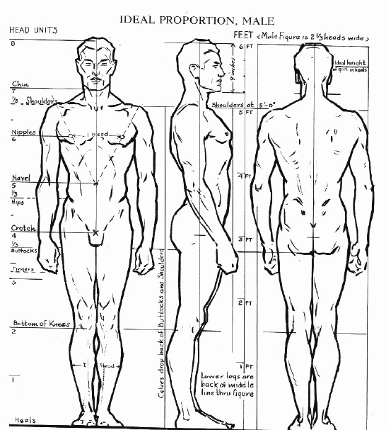

```{r setup, include=FALSE}
knitr::opts_chunk$set(echo = FALSE)

source("functions-project.R")
```

## Introduction

Andrew Loomis was a well known and influential art instructor in the mid 20th century. He authored a series of drawing manuals describing how to accurately depict the human body. Loomis proposed that to draw a male or female subject accurately, the artist should divide the figure into 8 sections, each approximately the length of the individual's head. This project summary is a brief exploration of the ideal body proportions proposed by Loomis through analysis of anatomic measurements.

<center></center>

## Preprocessing

The dataset is composed of measurements from 251 volunteers ranging in age from 1 to 94 years old. Since body proportions change throughout childhood, data points from volunteers under 18 years of age are eliminated. Loomis maintained that the same ratio applied to both males and females, so participants from both genders were included.

```{r, get_data,message=FALSE}

measure_data = utils::read.csv("final.measure.txt", header=TRUE, quote="", sep="|"); #read in the data
measure_cleaned = cleanUpData(measure_data) #group race, eye color, into buckets, standardize units, etc.
mc <- measure_cleaned[, -c(1:2)] #remove person/ collector ID columns
adults = mc[mc$age >= 18, ] #remove children

f <- adults[adults$gender == 'female', ]
m <- adults[adults$gender == 'male', ]

anf <- f[,!unlist(lapply(f,is.factor))] #remove factors
anf <- anf[,!unlist(lapply(anf,is.character))] #remove character columns
anf <- subset(anf, select = -c(quality, minutes, age)) #remove other non-measurement columns

anm <- m[,!unlist(lapply(m,is.factor))] #remove factors
anm <- anm[,!unlist(lapply(anm,is.character))] #remove character columns
anm <- subset(anm, select = -c(quality, minutes, age)) #remove other non-measurement columns

head(anf)
```

It looks like there are some NAs, and to evaluate data integrity, we should find out how much of the data is missing. For this analysis, volunteers were instructed to only submit measurements they were comfortable taking. It wouldn't be appropriate to omit an entire row because someone couldn't measure their head circumference or didn't want to add their race. We won't remove the rows with NAs, but it's still good to know what percentage of the attributes are missing.

```{r na_check}
women = round(colSums(is.na(anf))/nrow(anf), 2) #check for NAs as a percentage of the total amount of data
men = round(colSums(is.na(anm))/nrow(anm), 2) #check for NAs as a percentage of the total amount of data

rbind(women, men)
```

Next we need to identify and eliminate anomalous data points that may skew the results. These outliers are defined as any measurement with a z score of three or higher. The z score represents the number of standard deviations a data point is from the mean. Because there is an inherent variation in size across genders, the data will need to be partitioned before calculating mean and standard deviation.

```{r get_out}

# calculate z score for females
zf = as.data.frame(scale(anf))
zm = as.data.frame(scale(anm))

#remove outliers and merge tables
no_outliers_f <- zf[!rowSums(zf>3, na.rm = TRUE), ]
no_outliers_m <- zm[!rowSums(zm>3, na.rm = TRUE), ]
no_outliers = rbind(no_outliers_f, no_outliers_m)

cat(dim(adults)[1] - dim(no_outliers)[1], 'rows containing outliers were removed.')

no_outliers$inx <- as.numeric(row.names(no_outliers))
ready = adults[no_outliers$inx, ]

```

## Exploratory Data Analysis

Approximately 47% or respondents were female, 53% were male, and less than 1% identified as non binary. The average age of the study participants was 37, while the median age was 29. The ethnicity of the participants surveyed was 73.5% Caucasian, 17% Asian, 3.1% Hispanic, 1.3% African American, 3.1% mixed race, and 1.8% were members of other races.

```{r pies, fig.align = 'center'}
# install.packages("RColorBrewer")
library(RColorBrewer)
par(mfrow=c(2,1)) 
par( mai=c(0.1,0.3,0.2,0.5))

gen <- round(prop.table(table(droplevels(ready$gender)))*100,1)
lbls_g <- paste(names(gen), ": ", gen, "%", sep="")
color_mf <- brewer.pal(length(lbls_g), "PuBuGn") 
pie(gen, labels = lbls_g,  main="Gender", col = color_mf)

eth <- round(prop.table(table(ready$ethnicity))*100,1)
lbls_e <- paste(names(eth), ": ", eth, "%", sep="")
color_et <- brewer.pal(length(lbls_e), "PuBuGn") 
pie(eth, labels = lbls_e,   main="Ethicity", col = color_et)

```

Histograms that show the distribution of the deviation from the ideal standard head height to body height ratio proposed by Loomis.

```{r hist , fig.align = 'center'}
sub = na.omit(ready[, c("height", "head.height", "gender")])
sub$ratio =  sub$head.height/sub$height
sub$eighth = sub$height/8 
sub$percent_diff = ((sub$head.height - sub$eighth)/sub$head.height) * 100

par(mfrow=c(1,3)) 

hf = hist(sub$percent_diff[sub$gender=="female"], main = 'Female', xlab = 'Difference (%)', col = color_mf[1], xlim = c(-50, 50), ylim = c(0, 60), n = 7)
f_multiplier <- hf$counts/ hf$density
f_mydensity <- density(sub$percent_diff[sub$gender=="female"])
f_mydensity$y <- f_mydensity$y * f_multiplier[1]
lines(f_mydensity)

hm = hist(sub$percent_diff[sub$gender=="male"], main = 'Male', xlab = 'Difference (%)', col = color_mf[2], xlim = c(-50, 50), ylim = c(0, 60), n = 7)
m_multiplier <- hm$counts/ hm$density
m_mydensity <- density(sub$percent_diff[sub$gender=="male"])
m_mydensity$y <- m_mydensity$y * m_multiplier[1]
lines(m_mydensity)

ha = hist(sub$percent_diff, main = 'All', xlab = 'Difference (%)', col = color_mf[3], xlim = c(-50, 50), ylim = c(0, 60), n = 7)
multiplier <- ha$counts/ ha$density
mydensity <- density(sub$percent_diff)
mydensity$y <- mydensity$y * multiplier[1]
lines(mydensity)


```

There doesn't appear to be much difference between genders, but we can do a t test to confirm that hypothesis.

```{r t_test}
#Null hypothesis = the ratio of head height to total height is the same for male and female groups
t.test(sub$ratio[sub$gender=="male"], sub$ratio[sub$gender=="female"])
```

The p-value of 0.4364 is greater than the alpha of 0.05, therefor we fail to reject the null hypothesis. This means there is sufficient evidence to say that the difference in ratio of head height to total height is insignificant between genders.

```{r scatter , fig.align = 'center'}
sub$actual = sub$head.height/sub$height
plot(y = sub$height, x = sub$head.height, ylab = 'Height (in)', xlab = 'Head Length (in)', col = sub$gender, xlim= c(6, 14))
legend("bottomright", legend=c("Female", "Male"), col= c('red', 'blue'),  pch = 18, cex=0.8)
res=lm(sub$height~sub$head.height)
abline(res, col = 'purple')
lines(x = sub$eighth, y = sub$height, col = 'green')
legend("topright", legend=c("Actual", "Loomis"),
       col= c('purple', 'green'), lty = 1, cex=0.8)
```

A correlation matrix can be used to evaluate the linear dependence between attributes. In the heatmap below, red is used for a highly correlated attributes, and blue for data points with much lower evidence of dependency.

```{r correlations, fig.align = 'center'}

sub2 = ready[ ,c(1,2,3,18:25)]
sub2 = scale(sub2)
sub2 = as.data.frame(sub2)

# this is the standard correlation matrix
sub2.corr = cor(sub2, use = "complete.obs");

col<- colorRampPalette(c("blue", "white", "red"))(20)
heatmap(x = sub2.corr, col = col, symm = TRUE)

cat('Correlation matrix:\n')

sub3 = sub2[ ,c('height', 'head.height')]
sub3.corr = cor(sub3, use = "complete.obs")

sub3.corr


```

## Findings

The strongest positive correlation between measurements was the underarm height and overall height. Head height, however, was not shown to be dependent on total height. Out of all the data points, 68% were found to fall within +/- 10% of Loomis's ideal .125 ratio. The mean value from the sample data set was shown to be \~.132, and no significant difference in head to height ratio was observed across genders. Close to 70% of the volunteers in this study fell within 10% of Loomis's ideal body proportions when comparing head height to total body height.
